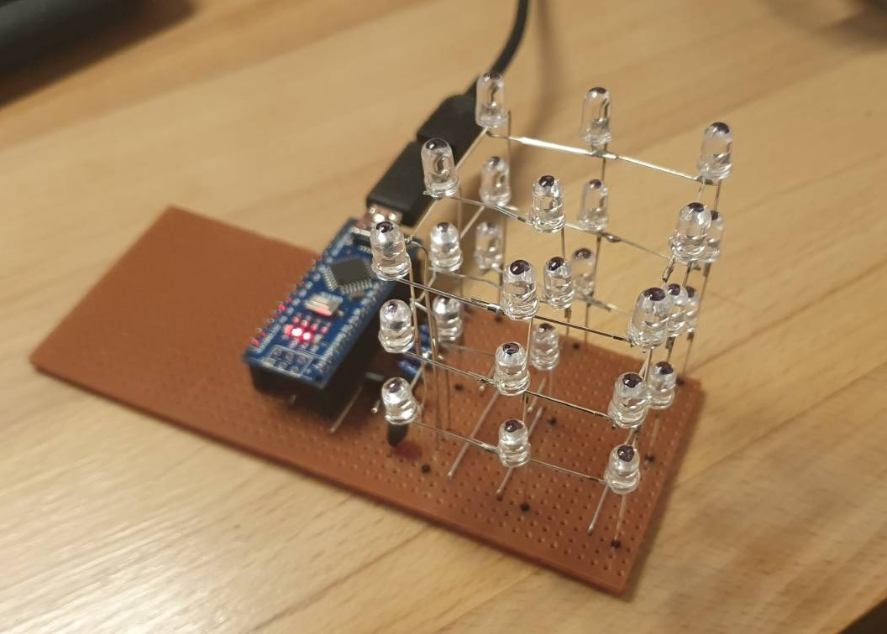

# stupid-led-cube

### This is a repository about a little 3x3x3 LED cube



## Components

For a 3x3x3 cube you will need:

| What | Qty | Note |
| --- | --- | --- |
| LEDs | 27 | Diffuse ones look better |
| Resistors | 9 | 220 ohm |
| Transistors | 3 | [2N3904](https://www.sparkfun.com/datasheets/Components/2N3904.pdf) |
| Arduino Nano | 1 | Any uController with >= 12 io pins should work |
| 1 x 15 0.1" Female Header | 2 | For the Arduino |
| Vero/Proto Board | 1 | To mount everything on |

Additionally, you will need some:

- Cardboard (For the soldering jig)
- Single core wire
- Solder
- Soldering Iron

I also found the following tools useful fo keeping everything neat:

- Fine nose pliers, For bending wires
- Side Snips, For trimming wires
- Wire Strippers, For Stripping Wires
- 3mm drill bit or Knife, To isolate veroboard tracks
- A Sharpie, because I always get lost on veroboard otherwise.

## Building the Cube

1. [DIY 3x3x3 LED Cube for Arduino Nano by RGBFreak (Instructables)](https://www.instructables.com/DIY-3x3x3-LED-Cube-for-Arduino-Nano/)

and 

2. [DIY 3X3X3 LED Cube with Arduino by Dilip Raja (circuitdigest.com)](https://circuitdigest.com/microcontroller-projects/making-3X3X3-led-cube-with-arduino)

Read them both and then do your own thing. I ended up using the cathode layout from the Instructables (1) post and the leg bending technique from the CircutDigest (2) post. 

## Building the Circuit

The best image of the circuit I built is from our favourite website for making [random electronics projects for nerds](https://randomnerdtutorials.com/arduino-led-cube-3x3x3/).


Dont look too closely at the pinout, and it's highly suggested that you check and double check that yours matches the code when you run it. 

If the pin is connected to a Resistor, its an Anode (+) and if it's a Transistor, it's a Cathode (-)

## Programming the Arduino

Essentially, the transistors control the layers via pins 3,2 and 13 on the Arduino, then pins 12 - 4 control the column that gets power at any point.

In an LED cube, the LEDs are typically addressed using a matrix configuration, where the rows and columns of the cube form a grid. Each LED is at the intersection of a row and a column, and the microcontroller selectively activates the appropriate row and column to light up a specific LED. This is known as multiplexing.

Here's a general explanation of how LEDs in a 3x3x3 LED cube might be addressed:

- Rows (Cathodes):
    - The layers or rows in the cube usually have common cathodes. These are the connections that run through all the LEDs in a single layer. For a 3x3x3 cube, there would be three layers, each with a common cathode connection.

- Columns (Anodes):
    - The columns in the cube have individual anodes. These are the connections that run through the LEDs in a column. For a 3x3x3 cube, there would be nine columns (3 columns in each of the 3 layers).

- Multiplexing:
    - The microcontroller (e.g., Arduino) activates one layer (row) at a time and then sets the appropriate columns (anodes) to turn on the desired LEDs in that layer. This process happens rapidly, and it gives the illusion that all the LEDs are on simultaneously.

- Programming:
    - The programming involves cycling through each layer and setting the columns accordingly. For example, in a 3x3x3 cube, you would iterate through the layers (rows) and columns to control each LED.

Here's a more refined example code for a 3x3x3 LED cube using an Arduino:

```cpp
const int cathodePins[] = {3, 2, 13};
const int anodePins[] = {12, 11, 10, 9, 8, 7, 6, 5, 4};

void setup() {
  for (int i = 0; i < 3; i++) {
    pinMode(cathodePins[i], OUTPUT);
    digitalWrite(cathodePins[i], LOW);
  }

  for (int i = 0; i < 9; i++) {
    pinMode(anodePins[i], OUTPUT);
    digitalWrite(anodePins[i], LOW);
  }
}

void loop() {
  for (int layer = 0; layer < 3; layer++) {
    activateLayer(layer);
    delay(5);  // Adjust delay as needed

    for (int col = 0; col < 9; col++) {
      for (int row = 0; row < 3; row++) {
        lightLED(row, col);
        delay(5);  // Adjust delay as needed
      }
    }

    deactivateLayer(layer);
  }
}

void activateLayer(int layer) {
  digitalWrite(cathodePins[layer], HIGH);
}

void deactivateLayer(int layer) {
  digitalWrite(cathodePins[layer], LOW);
}

void lightLED(int row, int col) {
  int anodeIndex = col;      // Anodes are connected to pins 12 to 4
  int cathodeIndex = row;     // Cathodes are connected to pins 3, 2, 13

  digitalWrite(anodePins[anodeIndex], HIGH);
  delay(1);  // Adjust delay as needed
  digitalWrite(cathodePins[cathodeIndex], HIGH);

  delay(5);  // Adjust delay as needed

  digitalWrite(cathodePins[cathodeIndex], LOW);
  digitalWrite(anodePins[anodeIndex], LOW);
}

```